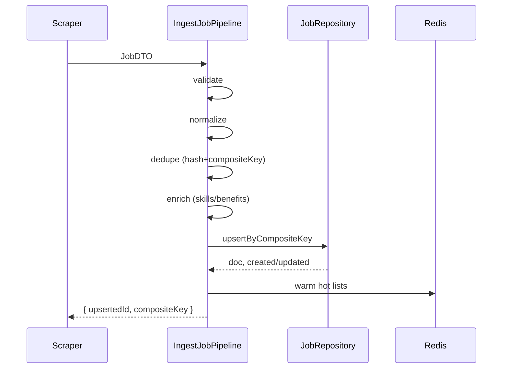
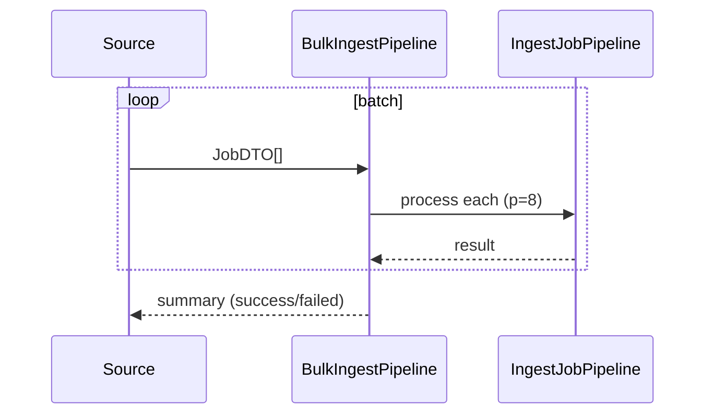

# Data Pipeline

Robust, additive data layer for near real-time job ingestion.

## Sequence (single job)

## Sequence (bulk)

## Env

- DATA_BASE_CURRENCY (default USD)
- DATA_DEFAULT_COUNTRY (default IN)
- DATA_DEDUPE_FUZZY_THRESHOLD (default 0.88)
- DATA_CACHE_TTL (default 300)
- DATA_CACHE_HOT_TTL (default 120)
- DATA_AUDIT_ENABLED (default true)
- DATA_PII_ENABLED (default false)
- DATA_PII_FIELDS (comma list)
- DATA_MAX_BATCH (default 500)
- DATA_INDEX_ENSURE (default true)

## Indexes

- compositeKey unique
- createdAt desc
- postedAt desc
- source+postedAt
- location.country+location.city+postedAt
- seniority+postedAt
- skills (multikey)+postedAt
- salary.normalizedAnnualMin/Max

## Backfill

- Run BulkIngestPipeline with batches <= DATA_MAX_BATCH
- Disable cache warm if needed to prevent storms

## Health

- Add to existing healthcheck: ping Mongo, Redis, verify Job indexes exist, attempt cache set/get.

## Ops runbook

- Mongo timeouts: increase pool, add retries in callers, check indexes
- Redis memory: review TTLs, key cardinality; raise memory or adjust policies
- Index build contention: rolling build off-peak, DATA_INDEX_ENSURE=false in hot deploys

